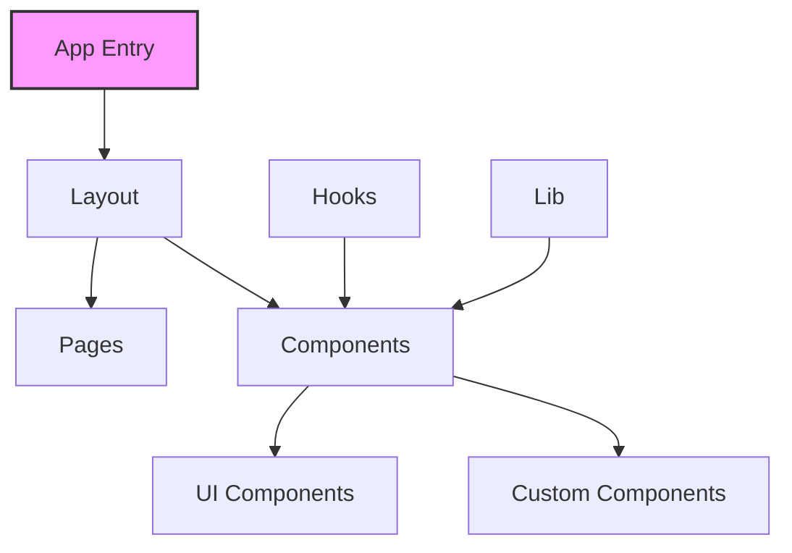
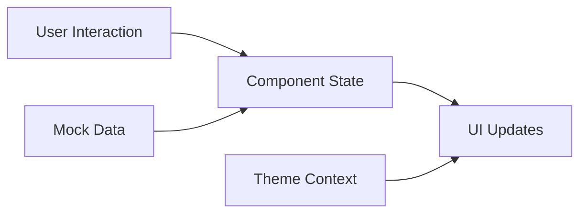
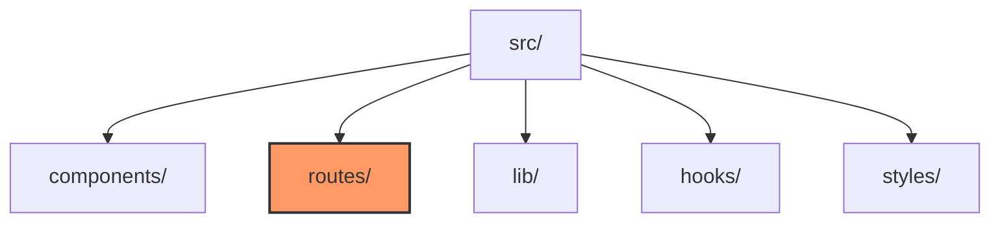

# Codebase Summary

## Key Components and Their Interactions

### Current Structure

### Primary Components
1. **Layout Components**
   - Header
   - Footer
   - Theme Provider

2. **Feature Components**
   - DealCard
   - DealGrid
   - CategoryFilter

3. **UI Components**
   - Extensive shadcn/ui component library
   - Theme toggle
   - Various Radix UI primitives

4. **Utility Components**
   - Mobile hooks
   - Toast notifications

## Data Flow

### Current Pattern

## External Dependencies
1. **UI Framework**
   - React 19
   - Multiple Radix UI components
   - shadcn/ui components

2. **Styling**
   - Tailwind CSS
   - PostCSS
   - CSS animations

3. **Data Management**
   - Mock data
   - Local state management

4. **Development Tools**
   - TypeScript
   - ESLint
   - PostCSS

## Planned Changes for Vite Migration

### 1. File Structure Updates

### 2. Key Changes
- Move from pages to routes directory
- Implement React Router configuration
- Update import/export paths
- Reorganize static assets
- Configure Vite build system

## Recent Significant Changes
1. Created documentation structure
2. Planned migration strategy
3. Identified key components for updates
4. Overhauled color styles for a lighter dark mode

## User Feedback Integration
Not applicable for current migration task - focusing on maintaining existing functionality while changing build system.

## Migration Impact Analysis
1. **Development Experience**
   - Faster development server
   - More efficient HMR
   - Simplified configuration

2. **Build Process**
   - Different build commands
   - New asset handling
   - Updated environment variables

3. **Code Organization**
   - New routing structure
   - Updated import paths
   - Modified static file handling

4. **Performance Expectations**
   - Faster development builds
   - Efficient production bundling
   - Improved HMR performance