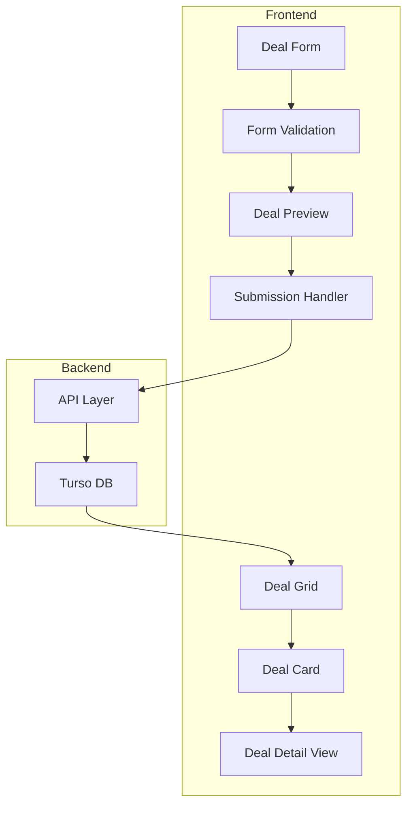

# Deal Posting System Implementation Plan

## Overview
Implementation of the core deal posting functionality for DealVibe, prioritizing user experience and data integrity while preparing for future feature integration.

## Architecture



## Components to Implement

### 1. DealSubmissionForm
- Form fields:
  - Title (required)
  - Description (required)
  - Price (required)
  - Store/retailer (required)
  - Deal URL (required)
  - Category (required)
  - Image upload (optional)
- Client-side validation using zod
- Real-time field validation
- Mobile-responsive layout
- Progress saving (auto-save draft)

### 2. DealPreview
- Real-time preview of deal card
- Mobile/desktop view toggle
- Image preview with optimization
- URL validation and preview

### 3. Enhanced DealCard
- Updated design for user attribution
- Posted date/time
- Store/retailer display
- Price history (preparation for tracking)
- Share functionality
- Save for later button (preparation for wishlists)

## Database Schema (Turso)

```sql
CREATE TABLE deals (
    id TEXT PRIMARY KEY,
    user_id TEXT NOT NULL,
    title TEXT NOT NULL,
    description TEXT NOT NULL,
    price DECIMAL NOT NULL,
    original_price DECIMAL,
    store TEXT NOT NULL,
    url TEXT NOT NULL,
    category TEXT NOT NULL,
    image_url TEXT,
    status TEXT DEFAULT 'active',
    created_at TIMESTAMP DEFAULT CURRENT_TIMESTAMP,
    updated_at TIMESTAMP DEFAULT CURRENT_TIMESTAMP,
    expires_at TIMESTAMP,
    FOREIGN KEY(user_id) REFERENCES users(id)
);

CREATE INDEX deals_category_idx ON deals(category);
CREATE INDEX deals_created_at_idx ON deals(created_at);
CREATE INDEX deals_store_idx ON deals(store);
```

## Implementation Phases

### Phase 1: Form Development (Week 1)
- [ ] Create form component structure
- [ ] Implement form fields with basic validation
- [ ] Add image upload functionality
- [ ] Implement URL validation and preview
- [ ] Add form progress saving
- [ ] Create success/error states

### Phase 2: Backend Integration (Week 1-2)
- [ ] Set up Turso database schema
- [ ] Create API endpoints for deal submission
- [ ] Implement image upload pipeline
- [ ] Add URL validation service
- [ ] Create draft saving functionality

### Phase 3: Deal Display Updates (Week 2)
- [ ] Update DealCard component
- [ ] Create DealPreview component
- [ ] Implement real-time preview
- [ ] Add share functionality
- [ ] Update DealGrid for new card format

### Phase 4: Testing & Optimization (Week 2-3)
- [ ] User testing of form submission
- [ ] Performance testing
- [ ] Mobile responsiveness testing
- [ ] Error handling improvements
- [ ] Form accessibility audit

## Integration Points

### Better Auth Integration
- User authentication check before form access
- User data association with deals
- Permission handling for editing/deleting

### Future Feature Preparation
1. **Comments System**
   - Deal ID structure ready for comments
   - UI space reserved in deal detail view

2. **Upvote System**
   - Deal schema includes vote tracking fields
   - UI elements reserved in deal card

3. **Gamification**
   - User points for deal posting
   - Deal quality metrics tracking

## Success Criteria
- Users can successfully submit deals
- Form provides clear feedback
- Drafts are reliably saved
- Images are properly optimized
- Mobile experience is smooth
- Load times under 2 seconds
- Failed submissions under 1%

## Monitoring & Analytics
- Track form completion rates
- Monitor submission success/failure
- Track deal engagement metrics
- Monitor image upload performance
- Track user feedback/issues

## Next Steps
After completion, move on to:
1. Comment system implementation
2. Upvote functionality
3. Mobile optimization improvements